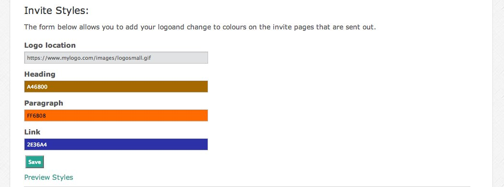

#Servertastic Reseller API Documentation

* [Reseller Dashboard](https://reseller.servertastic.com)
* [Servertastic Support](https://support.servertastic.com)
* <resellers@servertastic.com>

##Target Audience
The target audience for this document are Servertastic resellers, or
developers working on their behalf. This document gives an overview
of the API GET and POST requests and return values that allow
resellers to place, review and manage their orders.

* [Overview](#Overview)
* [Using the API](#using-the-api)
	* [Returned Data](#returned-data)
	* [Success and Errors](#success-and-errors)
	* [Test Environment](#test-environment)
	* [Example Usage](#example-usage)
	* [Invite Routine](#invite-routine)
* [Order Web Service Details](#order-web-service-details)
	* [`place`](#place)
	* [`review`](#review)
	* [`cancel`](#cancel)
	* [`resendemail`](#resendemail)
	* [`changeapproveremail`](#changeapproveremail)
	* [`modifiedorders`](#modifiedorders)
	* [`expiring`](#expiring)
	* [`approverlist`](#approverlist)
	* [`changeAuth`](#changeAuth)
	* [`pollauth`](#pollauth)
	* [`generateToken`](#generatetoken)
	* [`showTokens`](#showtokens)
* [ResellerAccount Web Service Details](#reselleraccount-web-service-details)
	* [`regenerateapikey`](#regenerateapikey)
	* [`review`](#reselleraccount-review)
	* [`addtestpoints`](#addtestpoints)
	* [`emptytestpoints`](#emptytestpoints)
* [Product Web Service Details](#product-web-service-details)
	* [`listproduct`](#listproduct)
* [Further Field Definitions](#further-field-definitions)

##Overview
We offer a series of simple API calls that allow resellers to place, modify and review orders by constructing a URL that contains a number of parameters that allow Servertastic to return relevant information or perform an action on the resellers behalf. The returned information can be displayed as XML (default) or JSON.

The API is organised into three services - `order`, `reselleraccount` and `products`. The order web service is the most commonly used at this point as it is concerned with all operations relating to an order. The `reselleraccount` service concentrates on all actions related to the resellers account and will be developed further in the future. The `products` section simple allows all products along with related information to be pulled.

##Using the API
This API is intended to be used by Servertastic resellers. For more information on becoming a reseller please contact <resellers@servertastic.com> or visit <https://www.servertastic.com/resellers>. 

Once you have become a reseller you will be provided with an `api_key` it is imperative that this is kept confidential at all times. It is also possible to use generated `order_token` to manage orders via the API without using an `api_key`. This allows you to make the `order_token` public while keeping your `api_key` private.

The `api_key` supports all functions. The `order_token` supports `place`, `review`, `resendemail` functions. When using `order_token` there is no need to use `reseller_unique_reference`. 

API Method|Supported Functions
:--|:--
`api_key`|All
`order_token`|`place`, `review`, `resendemail`, `changeapprover`, `pollauth`

###Returned Data
By default, the data is returned in an unstyled XML format. If required the returned data can be returned using JSON by appending .json to the web service section of the URL:

`https://api.servertastic.com/ssl/order.json/place?st_product_code=RapidSSL-24&api_key=abc123&end_customer_email=customer@domain.com&reseller_unique_reference=xyz01`

###Success and Errors

The first XML element under `response` will let you know whether the request was a success or encountered an error. If an error is encountered a message explaining the problem and an error code is returned. Generally speaking, if the error code is in the 400 range then there was a problem with the API request, a 500 error message signifies a problem with the API. When an error occurs the XML is presented in the following format:

	<?xml version="1.0"?>
	<response>
	  <error>
	    <code></code>
	    <message></message>
	  </error>
	</response>
	
###Test Environment
A test environment has been set-up in order for users of the API to develop solutions in a secure environment. To call the test environment, replace the call URL of `https://api.servertastic.com` with `https://test-api.servertastic.com`.

If you would like a test account configuring or run into problems with your test account please don’t hesitate to get in touch with us.

In addition to the test API a sandbox environment for the web interface is available at <https://test-reseller.servertastic.com> in order to gain access please accept the Terms and Conditions at <https://reseller.servertastic.com>.

###Example Usage
Depending on how you would like to use the API, there are a couple of ways of getting access to the methods. The simplest is to visit the URL in the web browser, this will perform the action and display either and XML/JSON response.

If you would like to call the methods in your scripts then technologies such as CURL are recommended, especially as it allows the XML to be retrieved in the event of a 403 error. Below is a quick PHP example for placing an order, the `$response` variable contains XML/JSON string:

	$url = 'https://api.servertastic.com/ssl/order.xml/place?st_product_code=RapidSSLWildcard-24&api_key=abc123&end_customer_email=customer@domain.com&reseller_unique_reference=reselref123';
	$ch = curl_init();
	curl_setopt($ch, CURLOPT_URL, $url);
	curl_setopt($ch, CURLOPT_RETURNTRANSFER, true);
	$response = curl_exec($ch);
	curl_close($ch);
	
The place call in the Order web service now allows information to be posted to the URL. Below is an example:

	$data=array(
	‘st_product_code’=>’RapidSSLWildcard-24’,
	‘api_key’=>’abc123’,
	‘end_customer_email’=>’customer@domain.com’,
	‘reseller_unique_reference’=>’ref123’
	);
	$data=http_build_query($data);
	$url = 'https://api.servertastic.com/ssl/order.xml/place';
	$ch = curl_init();
	curl_setopt($ch, CURLOPT_URL, $url);
	curl_setopt($ch, CURLOPT_RETURNTRANSFER, true);
	curl_setopt($ch, CURLOPT_POST, 1);
	curl_setopt($ch, CURLOPT_POSTFIELDS, $data);
	$response = curl_exec($ch);
	curl_close($ch);
	
###Invite Routine
When placing an order an invite link is generated. This link can be used to either complete the order and/or view the current status of the order.

As a reseller you can set the Invite Styles via the reseller dashboard. This includes adding a logo and setting a colour scheme.

##Order Web Service Details

###`place`
The `place` call allows an order to be placed, upon successful completion the returned XML shows the unique Servertastic order number along with the invite URL from the certificate provider or product licenses. This section is broken down into SSL and SmarterTools orders as different parameters are required and the response from the API varies.

This API call now supports both the `POST` and `GET` method. This was added in order for resellers to submit the csr for an order.

####SSL Products
When placing an order with the API, the order will perform an invite routine or bypass this step and place the order with the CA and jump straight to the domain approver email stage. The field that triggers an order instead of an invite is the `approver_email_address`, if this is set then the `technical`, `administration` and `csr` (either generated or provided) need to be provided. This only currently works for Domain Validated products.

If your order uses the invite process and you do not want the invite email to be sent to the end customer then set the `end_customer_email` to `none`. If an email is provided for the end customer, then they will receive an email from certificate provider containing the Invite link if the order is in the invite process. The `reseller_unique_reference` can be any string but it must not have been previously used by the reseller, it uniquely identifies the order with the certificate provider and prevents multiple ordering in the event of a problem. 

The `technical` contact, `administration` contact and `organisational` information is optional but if the information is supplied then all of the corresponding field must be completed. If they are provided they cannot be edited by the customer in the order process.

All orders can pass on a `csr` (if the approver email has been provided then it is required) so the customer doesn’t have to supply this, it can be supplied directly using the `csr` field or the API can create one using the organisation, admin contact email and domain_name fields. If the `csr` is to be supplied, it can only be sent using the `POST` method. If you do not supply the `csr` and instead supply only the `domain_name` then the `csr` and `private_key` will be returned in the success response. But for security reasons, this information is not stored and cannot be retrieved at a later time.

Domain validated orders can be approved in three ways, `EMAIL` (default), `FILE` and `DNS`. The `FILE` option requires a FILE to be placed on the server with a specific name and specific contents. The `DNS` authentication method requires a user to create a CNAME record in this format:
                                        
`s<randomstring>.domain.com` (randomstring is returned in the API response) and pointed to a timestamped entry in the format `s<YYYYMMddHHmmss>.domain.com` where the timestamp is the current time and date.

**`place` order request**

`https://api.servertastic.com/ssl/order/place?st_product_code=[Product Code]&api_key=[Reseller API Key]&end_customer_email=[Email address|’none’]&reseller_unique_reference=[Unique order reference supplied by the reseller - 35 chars maximum]`

**Using `order_token`**

`https://api.servertastic.com/ssl/order/place?order_token=[Previously generated order_token]&end_customer_email=[Email address|’none’]`

For full field information see [Fields](#fields)

**`place` order response**

~~~xml
<?xml version="1.0"?>
<response>
  <success>Order placed</success>
  <reseller_order_id></reseller_order_id> *Used in all future calls
  <invite_url></invite_url>
  <csr></csr> *If CSR generated by API
  <private_key></private_key> *If CSR generated by API
  <file_name></file_name> *If generated by API
  <file_contents></file_contents> *If generated by API
  <dns_string></file_contents> *If generated by API
</response>
~~~
	
###Fields

Field Name | Required | Further Information
:--|:--|:--
`st_product_code`| Required unless `order_token` is present
`api_key` | Required unless `order_token` is present
`end_customer_email` | Required | Email address of `none` accepted
`reseller_unique_reference` | Required but may be set by `order_token` | 35 character limit
`server_count` | Required for some products
`san_count` | Required for some products
`approver_email_address` | Optional | If defined order will be placed bypassing invite routine
`tech_contact_first_name` | Optional but required if `approver_email_address` is defined
`tech_contact_last_name` | Optional but required if `approver_email_address` is defined
`tech_contact_phone` | Optional but required if `approver_email_address` is defined
`tech_contact_email` | Optional but required if `approver_email_address` is defined
`tech_contact_title` | Optional but required if `approver_email_address` is defined
`admin_contact_first_name` | Optional but required if `approver_email_address` is defined
`admin_contact_last_name` | Optional but required if `approver_email_address` is defined
`admin_contact_phone` | Optional but required if `approver_email_address` is defined
`admin_contact_email` | Optional but required if `approver_email_address` is defined
`admin_contact_title` | Optional but required if `approver_email_address` is defined
`org_name` | Optional but required if `approver_email_address` is defined but the csr field isn’t
`org_division` | Optional but required if `approver_email_address` is defined but the csr field isn’t
`org_address_city` | Optional but required if `approver_email_address` is defined but the csr field isn’t
`org_address_region` | Optional but required if `approver_email_address` is defined but the csr field isn’t
`org_address_country` | Optional but required if `approver_email_address` is defined but the csr field isn’t
`domain_name` | Optional but required if `approver_email_address` is defined but the csr field isn’t
`csr` | Optional but required if `approver_email_address` is defined and organisation details aren’t
`renewal` | Optional. | You can set if this order is a renewal `1` or `0`
`competitive_upgrade` | Optional. | If your domain has a certificate from a competitor you can set this to true. `1` or `0`
`dv_auth_method` | Optional but required if `approver_email_address` is defined. | Expected values `EMAIL` (default), `FILE` and `DNS`
`hashing_algorithm` | Optional. | Expected values `SHA1` and `SHA2-256 `(default)
`order_token` | Optional | If set the order will be placed using the product code specified when the token was generated.

####SmarterTools Products
The place call for the SmarterTools products works in the same was as for the SSL products above but the information that is required varies slightly. For example many of the fields aren’t required and an end customer email address must be specified. Please note a bundle can only ever be assigned to an email address once, across the SmarterTools system.

Before using these API calls Resellers must login to the web interface at <https://reseller.servertastic.com> and activate the product group by accepting the Terms and Conditions.

**`place` order request**

`https://api.servertastic.com/smartertools/order/place?st_product_code=[Product Code]&api_key=[Reseller API Key]&end_customer_email=[Email address that the bundle is assigned to]&reseller_unique_reference=[Unique order reference supplied by the reseller - 35 chars maximum]`

**`place` order response**

The response details license information for the Bundle or product which can be retrieved at a later date using the review call. In addition to this an account password will be shown if the user is a new SmarterTools customer but left blank if they are one already. This information is not stored by Servertastic for security purposes.

	<?xml version="1.0"?>
	<response>
	  <success>Order placed</success>
	  <reseller_order_id></reseller_order_id> *Used in all future calls
	  <account_password></account_password>
	  <order_licenses>*May be multiple
	          <license>
	                <product_name></product_name>
	                <license_key></license_key>
	        </license>
	  </order_licenses>
	</response>

###`review`
The review call shows the status and all information that is currently available for an order. The call interrogates the Servertastic database that is updated every five minutes. This may mean that the information presented could be up to five minutes old.

####SSL Orders

**`review` order request**

`https://api.servertastic.com/ssl/order/review?api_key=[Reseller API key]&reseller_order_id=[Reseller Order ID]`

**Using `order_token`**

`https://api.servertastic.com/ssl/order/review?order_token=[current order_token]`

**`review` order response**

Depending on the stage of the order, some information may be blank.

	<?xml version="1.0"?>
	<response>
	  <success>Review Order</success>
	  <reseller_order_id></reseller_order_id>
	  <provider_order_id></provider_order_id>
	  <st_product_code></st_product_code>
	  <order_status></order_status>
	  <order_state_further_info></order_state_further_info>
	  <domain_name></domain_name>
	  <san_count></san_count>
	  <additional_sans></additional_sans>
	  <server_count></server_count> *Only shows if relevant to product
	  <invite_url></invite_url>
	  <end_customer_email></end_customer_email>
	  <organisation_info>
	    <name></name>
	    <division></division>
	    <address>
	      <city></city>
	      <region></region>
	      <country></country>
	    </address>
	  </organisation_info>
	  <approver_notified_date></approver_notified_date>
	  <approver_email_address></approver_email_address>
	  <admin_contact>
	    <title></title>
	    <first_name></first_name>
	    <last_name></last_name>
	    <phone></phone>
	    <email></email>
	  </admin_contact>
	  <tech_contact>
	    <title></title>
	    <first_name></first_name>
	    <last_name></last_name>
	    <phone></phone>
	    <email></email>
	  </tech_contact>
	  <modifications>
	    <modification> *Could be multiple
	      <timestamp></timestamp>
	      <event_id></event_id>
	      <event_name></event_name>
	    </modification>
	  </modifications>
	  <certificate></certificate>
	  <reissued_certificates> *shown if multiple certs have been reissued
	        <certificate_info>*may be multiple
	                <hash></hash>
	                <encryption></encryption>
	                <certificate></certificate>
	        </certificate_info>
	  </reissued_certificates>
	  <ca_certs> *shown if CA certs are present
	        <certificate_info>*may be multiple
	                <type></type> *INTERMEDIATE or ROOT
	                <certificate></certificate>
	        </certificate_info>
	  </reissued_certificates>
	<expiry_date></expiry_date>
	</response>
	
####Possible `order_status` values
`order_status` | Description 
:--|:--
Order Placed | Order has been placed
Awaiting Customer Verification | The invite link has been completed and the domain is awaiting an action by the customer
Awaiting Provider Approval | The certificate is undergoing moderation from the certificate provider
Queued | The order has been queued by the certificate issuer.
Completed | The order has been completed and has been sent to the end user.
Cancelled | The order was cancelled either by the reseller, domain approver or the certificate provider
Roll Back | There was a problem placing the order in the Servertastic systems, the order needs to be placed again.
Servertastic Review | The order has been flagged for review by Servertastic and the points will not be released until the issue has been resolved.

####SmarterTools Orders

**`review` order request**

`https://api.servertastic.com/smartertools/order/review?api_key=[Reseller API key]&reseller_order_id=[Reseller Order ID]`

**`review` order response**

	<?xml version="1.0"?>
	<response>
	  <success>Review Order</success>
	  <reseller_order_id></reseller_order_id>
	  <provider_order_id></provider_order_id>
	  <st_product_code></st_product_code>
	  <order_status></order_status>
	  <order_licenses>
	          <license> *May be multiple
	                <product_name></product_name>
	                <license_key></license_key>
	        </license>
	  </order_licenses>
	 </response>
 
###`cancel`
 
This call cancels an order that is placed by a reseller and reinstates the points used for that order. Orders can only be cancelled prior to domain approval and this call cannot be used at all on SmarterTools orders.

**`cancel` request**

`https://api.servertastic.com/ssl/order/cancel?api_key=[Your API Key]&reseller_order_id=[Reseller Order ID]`

**`cancel` response**

	<?xml version="1.0"?>
	<response>
	  <success>Order cancelled - [order number]</success>
	</response>
	
###`resendemail`

This call requests for the emails that have been sent to the end customers throughout the order process to be resent.  This call cannot be used at all on SmarterTools orders.

**`resendemail` request**

`https://api.servertastic.com/ssl/order/resendemail?api_key=[Your API Key]&reseller_order_id=[Reseller Order ID]&email_type=[‘Invite’ | ‘Approver’ | ‘Fulfillment’]`

**Using `order_token`**

`https://api.servertastic.com/ssl/order/resendemail?order_token=[Current order_token]&email_type=[‘Invite’ | ‘Approver’ | ‘Fulfillment’]
`

**`resendemail` response**

	<?xml version="1.0"?>
	<response>
	  <success>Email resent</success>
	  <type>Fulfillment</type>
	  <email_sent_to>
	    <invite_email></invite_email>
	    <approver_email></approver_email>
	    <admin_contact_email></admin_contact_email>
	    <tech_contact_email></tech_contact_email>
	  </email_sent_to>
	</response>

###`changeapproveremail`

This call is used to change the approveremail that can be used to complete domain validated orders. See [`approverlist`](#approverlist)

`https://api.servertastic.com/ssl/order/changeapproveremail?api_key=[Your API Key]&reseller_order_id=[Reseller Order ID]&email=[New domain approver email address]`

**Using `order_token`**

`https://api.servertastic.com/ssl/order/changeapproveremail?order_token=[Current order_token]&email=[New domain approver email address]
`

**`changeapproveremail` response**

	<?xml version="1.0"?>
	<response>
	  <success>Change Approver Email Reset</success>
	</response>
	
###`modifiedorders`

This call returns details of orders that have been modified since a given date. Due to the fact that the Servertastic information is updated every 5 minutes it is possible that we do not possess all information up to the specified time. As a result an extra piece of information is returned, ‘data_accuracy’, which will tell you the timestamp of the last modification in the Servertastic system for the returned data. If you are running this call in a script, please store this information and use it to make any subsequent calls. Please note, the date/time is GMT.

**`modifiedorders` request**

`https://api.servertastic.com/ssl/order/modifiedorders?api_key=[Your API Key]&date=[YYYY-MM-DD 00:00:00 eg 2012-07-19 09:45:45]
`

**`modifiedorders` response**

	<?xml version="1.0"?>
	<response>
	  <success>Modified Orders</success>
	  <orders>
	        <order>*Maybe multiple
	  <reseller_order_id></reseller_order_id>
	  <provider_order_id></provider_order_id>*or
	  <truste_account_id></truste_account_id>
	  <st_product_code></st_product_code>
	  <order_status></order_status>
	  <order_state_further_info></order_state_further_info>
	  <domain_name></domain_name>
	  <san_count></san_count>
	  <additional_sans></additional_sans>
	  <server_count></server_count> *Only shows if relevant to product
	  <invite_url></invite_url>
	  <end_customer_email></end_customer_email>
	  <organisation_info>
	    <name></name>
	    <division></division>
	    <address>
	      <city></city>
	      <region></region>
	      <country></country>
	    </address>
	  </organisation_info>
	  <approver_notified_date></approver_notified_date>
	  <approver_email_address></approver_email_address>
	  <admin_contact>
	    <title></title>
	    <first_name></first_name>
	    <last_name></last_name>
	    <phone></phone>
	    <email></email>
	  </admin_contact>
	  <tech_contact>
	    <title></title>
	    <first_name></first_name>
	    <last_name></last_name>
	    <phone></phone>
	    <email></email>
	  </tech_contact>
	  <modifications>
	    <modification> *Could be multiple
	      <timestamp></timestamp>
	      <event_id></event_id>
	      <event_name></event_name>
	    </modification>
	  </modifications>
	  <certificate></certificate>
	<expiry_date></expiry_date>
	    </order>
	</orders>
	<data_accuracy></data_accuracy>
	</response>
	
###`expiring`

The expiring call allows you to return all orders expiring with a specified time period. If the domain has had the same product purchased for it that expires after the original the record won’t be returned.

####SSL Orders

**`expiring` order request**

`https://api.servertastic.com/ssl/order/expiring?api_key=[Reseller API key]&days=[Expiring time period. Defaults to 60]
`

**`expiring` order response**

	<?xml version="1.0"?>
	<response>
	  <success>Expiring Orders</success>
	  <orders>
	    <order> *Could be multiple
	       <reseller_order_id></reseller_order_id>
	       <order_status></order_status>
	       <order_date></order_date>
	          <domain_name></domain_name>
	  <order_points></order_points>
	  <expiry_date></expiry_date>
	  <st_product_code></st_product_code>
	     </order>
	   </orders>
	</response>
	
###`approverlist`

The approverlist call allows you to retrieve all acceptable domain approver email addresses for the specified domain name

**`approverlist` order request**

`https://api.servertastic.com/ssl/order/approverlist?api_key=[Reseller API key]&domain_name=[The domain name you want approvers for]`

**`approverlist` order response**

	<?xml version="1.0"?>
	<response>
	  <success>ApproverList</success>
	  <approver_email> *Could be multiple
	    <email></email>
	   </approver_email>
	</response>

###`changeAuth`

This call allows orders for domain validated products, that have either FILE or DNS authentication set, to change the authentication method back to Email.

**`changeAuth` request**

`https://api.servertastic.com/ssl/order/changeauth?api_key=[Your API Key (can be replaced with order_token)]&reseller_order_id=[Reseller Order ID]`

**`changeAuth` response**

	<?xml version="1.0"?>
	<response>
	  <success>DV Auth Method Updated</success>
	</response>

###`pollAuth`

This call allows users to initiate an authentication check for domain validated products, that have either FILE or DNS authentication set. This should be ran after the file has been uploaded or the DNS records created.

**`pollAuth` request**

`https://api.servertastic.com/ssl/order/pollauth?api_key=[Your API Key]&reseller_order_id=[Reseller Order ID]`

**Using `order_token`**

`https://api.servertastic.com/ssl/order/pollauth?order_token=[Current order_token]`

**`pollAuth` response**

	<?xml version="1.0"?>
	<response>
	  <success>Order Polled</success>
	  <status></status>*If FILE Auth
	</response>
	
###`generateToken`

This call allows resellers to generate an order token that can be used to place or take actions on an order instead of the API key. This is particularly useful for control panel integration

**`generateToken` request**

`https://api.servertastic.com/ssl/order/generatetoken?api_key=[Your API Key]&st_product_code=[Product Code]&reseller_unique_reference=[Unique order reference supplied by the reseller - 35 chars maximum]`

**`generateToken` response**

	<?xml version="1.0"?>
	<response>
	  <success>Order token generated</success>
	  <order_token></order_token>
	  <product_code></product_code>
	</response>
	
###`showTokens`

This call allows resellers to keep track of tokens that have been generated and which ones have been used.

**`showTokens` request**

`https://api.servertastic.com/ssl/order/showtokens?api_key=[Your API Key]`

**`showTokens` response**

	<?xml version="1.0"?>
	<response>
	  <success>Order tokens</success>
	  <unused_tokens>
	        <order_token> *could be multiple
	                <token></token>
	                <reseller_unique_reference></reseller_unique_reference>
	        </order_token
	  </unused_tokens>
	  <used_tokens>
	        <order_token> *could be multiple
	                <token></token>
	                <reseller_unique_reference></reseller_unique_reference>
	        </order_token
	  </unused_tokens>
	</response>
	
##ResellerAccount Web Service Details

###`regenerateapikey`

This call allows a reseller to regenerate their API key.

**`regenerateapikey` request**

`https://api.servertastic.com/ssl/reselleraccount/regenerateapikey?api_key=[Your API Key]`

**`regenerateapikey` response**

	<?xml version="1.0"?>
	<response>
	  <success>API Key reset</success>
	  <api_key></api_key>
	</response>
	
###`review`

This call returns information about the reseller associated with the provided API key, including the number of points that are available to spend and the details of each order that is currently in the Servertastic system.

**`review` request**

`https://api.servertastic.com/ssl/reselleraccount/review?api_key=[Your API Key]`

**`review` response**

	<?xml version="1.0"?>
	<response>
	  <success>Reseller Overview</success>
	  <purchased_points></purchased_points>
	  <in_use_points></in_use_points>
	  <active_orders>
	    <active_order> *Could be multiple
	       <reseller_order_id></reseller_order_id>
	       <order_status></order_status>
	       <order_date></order_date>
	          <domain_name></domain_name>
	  <order_points></order_points>
	  <expiry_date></expiry_date>
	  <st_product_code></st_product_code>
	     </active_order>
	   </active_orders>
	 <completed_orders>
	    <completed_order> *Could be multiple
	       <reseller_order_id></reseller_order_id>
	       <order_status></order_status>
	       <order_date></order_date>
	  <domain_name></domain_name>
	  <order_points></order_points>
	  <expiry_date></expiry_date>
	  <st_product_code></st_product_code>
	     </completed_order>
	   </completed_orders>
	</response>
	
###`addtestpoints`

This call allows resellers to add points to their account in order to aid testing. This call will only work within the test environment.

**`addtestpoints` request**

`https://test-api.servertastic.com/ssl/reselleraccount/addtestpoints?api_key=[Your API Key]&points=[The number of points you would like to add]
`

**`addtestpoints` response**

	<?xml version="1.0"?>
	<response>
	  <success>Points total updated</success>
	  <new_total></new_total>
	</response>
	
###`emptytestpoints`

This call allows resellers to set their point level to 0 for their account in order to aid testing. This call will only work within the test environment.

**`emptytestpoints` request**

`https://test-api.servertastic.com/ssl/reselleraccount/emptytestpoints?api_key=[Your API Key]`

**`emptytestpoints` response**

	<?xml version="1.0"?>
	<response>
	  <success>Points total updated</success>
	  <new_total>0</new_total>
	</response>
	
##Product Web Service Details

###`listproduct`

This call returns all the products available through the reseller system, along with associated information such as price and SAN count. If a 

**`listproduct` request**

`https://api.servertastic.com/ssl/product/listproducts?api_key=[Your API Key]&product_group=[‘SSL’, ‘SmarterTools’, ‘Truste’ or ‘All’]
`

**`listproduct` response**

	<?xml version="1.0"?>
	<response>
	  <success>Product list</success>
	   <products>
	   <st_product_code></st_product_code>
	   <product_name></product_name>
	   <html_description></html_description>
	   <max_server_count></max_server_count>
	   <min_san_count></min_san_count>
	   <max_san_count></max_san_count>
	   <base_san_points></base_san_points>
	   <product_points></product_points>
	  </products>
	</response>
	
##Further Field Definitions

###RapidSSL

Product Code | Product Description | Server Count Values | SAN Values
:--|:--|:--|:--
`RapidSSL-12` | RapidSSL - 1 Years | Not Applicable | Not Applicable
`RapidSSL-24` | RapidSSL - 2 Years | Not Applicable | Not Applicable
`RapidSSL-36` | RapidSSL - 3 Years | Not Applicable | Not Applicable
`RapidSSLWildcard-12` | RapidSSL Wildcard - 1 Years | Not Applicable | Not Applicable
`RapidSSLWildcard-24` | RapidSSL Wildcard - 2 Years | Not Applicable | Not Applicable
`RapidSSLWildcard-36` | RapidSSL Wildcard - 3 Years | Not Applicable | Not Applicable

###Geotrust

Product Code | Product Description | Server Count Values | SAN Values
:--|:--|:--|:--
`QuickSSLPremium-12` | QuickSSL Premium - 1 Years | Not Applicable | Not Applicable
`QuickSSLPremium-24` | QuickSSL Premium - 2 Years | Not Applicable | Not Applicable
`QuickSSLPremium-36` | QuickSSL Premium - 3 Years | Not Applicable | Not Applicable
`QuickSSLPremiumMD-12` | QuickSSL Premium Multi Domain - 1 Years | Not Applicable | 4-4
`QuickSSLPremiumMD-24` | QuickSSL Premium Multi Domain - 2 Years | Not Applicable | 4-4
`QuickSSLPremiumMD-36` | QuickSSL Premium Multi Domain - 3 Years | Not Applicable | 4-4
`TrueBizID-12`| True BusinessID - 1 Years | Not Applicable | Not Applicable
`TrueBizID-24` | True BusinessID - 2 Years | Not Applicable | Not Applicable
`TrueBizID-36` | True BusinessID - 3 Years | Not Applicable | Not Applicable
`TrueBizIDWildcard-12` | True BusinessID Wildcard - 1 Years | Not Applicable | Not Applicable
`TrueBizIDWildcard-24` | True BusinessID Wildcard - 2 Years | Not Applicable | Not Applicable
`TrueBizIDWildcard-36` | True BusinessID Wildcard - 3 Years | Not Applicable | Not Applicable
`TrueBizIDEV-12` | True BusinessID with EV - 1 Years | Not Applicable | Not Applicable
`TrueBizIDEV-24` | True BusinessID with EV - 2 Years | Not Applicable | Not Applicable
`TrueBizIDMD-12` | True Business ID with SAN - 1 Years | Not Applicable | 4-24
`TrueBizIDMD-24` | True Business ID with SAN - 2 Years | Not Applicable | 4-24
`TrueBizIDMD-36` | True Business ID with SAN - 3 Years | Not Applicable | 4-24
`TrueBizIDEVMD-12` | True BusinessID with EV with SAN - 1 Years | Not Applicable | 4-24
`TrueBizIDEVMD-24` | True BusinessID with EV with SAN - 2 Years | Not Applicable | 4-24
`AntiMalwareBasic-12` | Geotrust Anti-Malware Scan Basic - 1 Years | Not Applicable | Not Applicable
`AntiMalwareBasic-24` | Geotrust Anti-Malware Scan Basic - 2 Years | Not Applicable | Not Applicable
`AntiMalwareBasic-36` | Geotrust Anti-Malware Scan Basic - 3 Years | Not Applicable | Not Applicable
`AntiMalware-12` | Geotrust Anti-Malware Scan - 1 Years | Not Applicable | Not Applicable
`AntiMalware-24` | Geotrust Anti-Malware Scan - 2 Years | Not Applicable | Not Applicable
`AntiMalware-36` | Geotrust Anti-Malware Scan - 3 Years | Not Applicable | Not Applicable
- When purchasing a TrueBizID Multidomain product the price includes the first four SANs.
- When purchasing a QuickSSL Premium Multi Domain the price includes 4 SANs.

###Symantec

Product Code | Product Description | Server Count Values | SAN Values
:--|:--|:--|:--
`SecureSite-12` | Secure Site - 1 Years | 1 - 500 | 0-24
`SecureSite-24` | Secure Site - 2 Years | 1 - 500 | 0-24
`SecureSite-36` | Secure Site - 3 Years | 1 - 500 | 0-24
`SecureSiteEV-12` | Secure Site with EV - 1 Years | 1 - 500 | 0-24
`SecureSiteEV-24` | Secure Site with EV - 2 Years | 1 - 500 | 0-24
`SecureSitePro-12` | Secure Site Pro - 1 Years | 1 - 500 | 0-24
`SecureSitePro-24` | Secure Site Pro - 2 Years | 1 - 500 | 0-24
`SecureSitePro-36` | Secure Site Pro - 3 Years | 1 - 500 | 0-24
`SecureSiteProEV-12` | Secure Site Pro with EV - 1 Years | 1 - 500 | 0-24
`SecureSiteProEV-24` | Secure Site Pro with EV - 2 Years | 1 - 500 | 0-24
`SymantecSafeSite-12` | Symantec Safe Site - 1 Years | Not Applicable | Not Applicable
`SymantecSafeSite-24` | Symantec Safe Site - 2 Years | Not Applicable | Not Applicable
`SymantecSafeSite-36` | Symantec Safe Site - 3 Years | Not Applicable | Not Applicable

###Thawte

Product Code | Product Description | Server Count Values | SAN Values
:--|:--|:--|:--
`SSLWebServer-12` | SSL Web Server - 1 Years | Not Applicable | 0-24
`SSLWebServer-24` | SSL Web Server - 2 Years | Not Applicable | 0-24
`SSLWebServer-36` | SSL Web Server - 3 Years | Not Applicable | 0-24
`SSLWebServerWildcard-12` | SSL Web Server Wildcard - 1 Years | Not Applicable | Not Applicable
`SSLWebServerWildcard-24` | SSL Web Server Wildcard - 2 Years | Not Applicable | Not Applicable
`SSLWebServerEV-12` | SSL Web Server with EV - 1 Years | Not Applicable | 0-24
`SSLWebServerEV-24` | SSL Web Server with EV - 2 Years | Not Applicable | 0-24
`SSL123-12` | SSL123 - 1 Years | Not Applicable | Not Applicable
`SSL123-24` | SSL123 - 2 Years | Not Applicable | Not Applicable
`SSL123-36` | SSL123 - 3 Years | Not Applicable | Not Applicable

###SmarterTools Bundle

Product Code | Product Description
:--|:--
`SmarterBundle` | SmarterTools Bundle Pack

###SmarterTools SmarterMail

Product Code | Product Description
:--|:--
`SmarterMailPro-250` | SmarterMail Pro - 250 Mailboxes
`SmarterMailPro-500` | SmarterMail Pro - 500 Mailboxes
`SmarterMailPro-1000` | SmarterMail Pro - 1000 Mailboxes
`SmarterMailPro-2000` | SmarterMail Pro - 2000 Mailboxes
`SmarterMailPro-Unlimited` | SmarterMail Pro - Unlimited Mailboxes
`SmarterMailEnt-250` | SmarterMail Ent - 250 Mailboxes
`SmarterMailEnt-500` | SmarterMail Ent - 500 Mailboxes
`SmarterMailEnt-1000` | SmarterMail Ent - 1000 Mailboxes
`SmarterMailEnt-2000` | SmarterMail Ent - 2000 Mailboxes
`SmarterMailEnt-Unlimited` | SmarterMail Ent - Unlimited Mailboxes

###SmarterTools SmarterStats

Product Code | Product Description
:--|:--
`SmarterStatsPro-50` | SmarterStats Pro - 50 Sites
`SmarterStatsPro-250` | SmarterStats Pro -250 Sites
`SmarterStatsPro-1000` | SmarterStats Pro - 1000 Sites
`SmarterStatsPro-2500` | SmarterStats Pro - 2500 Sites
`SmarterStatsEnt-50` | SmarterStats Ent - 50 Sites
`SmarterStatsEnt-250` | SmarterStats Ent -250 Sites
`SmarterStatsEnt-1000` | SmarterStats Ent - 1000 Sites
`SmarterStatsEnt-2500` | SmarterStats Ent - 2500 Sites
`SmarterStatsEnt-5000` | SmarterStats Ent - 5000 Sites
`SmarterStatsEnt-10000` | SmarterStats Ent - 10000 Sites
`SmarterStatsEnt-20000` | SmarterStats Ent - 20000 Sites
`SmarterStatsEnt30000` | SmarterStats Ent - 300000 Sites

###SmarterTools SmarterTrack

Product Code | Product Description
:--|:--
`SmarterTrackPro-2` | SmarterTrack Pro - 2 Agents
`SmarterTrackPro-5` | SmarterTrack Pro - 5 Agents
`SmarterTrackPro-10` | SmarterTrack Pro - 10 Agents
`SmarterTrackEnt-2` | SmarterTrack Ent - 2 Agents
`SmarterTrackEnt-5` | SmarterTrack Ent - 5 Agents
`SmarterTrackEnt-10` | SmarterTrack Ent - 10 Agents
`SmarterTrackEnt-15` | SmarterTrack Ent - 15 Agents
`SmarterTrackEnt-20` | SmarterTrack Ent - 20 Agents
`SmarterTrackEnt-25` | SmarterTrack Ent - 25 Agents
`SmarterTrackEnt-50` | SmarterTrack Ent - 50 Agents
`SmarterTrackEnt-100` | SmarterTrack Ent - 100 Agents
`SmarterTrackEnt-200` | SmarterTrack Ent - 200 Agents
`SmarterTrackEnt-300` | SmarterTrack Ent - 300 Agents
`SmarterTrackEnt-400` | SmarterTrack Ent - 400 Agents
`SmarterTrackEnt-500` | SmarterTrack Ent - 500 Agents
`SmarterTrackEnt-600` | SmarterTrack Ent - 600 Agents
`SmarterTrackEnt-700` | SmarterTrack Ent - 700 Agents
`SmarterTrackEnt-800` | SmarterTrack Ent - 800 Agents
`SmarterTrackEnt-900` | SmarterTrack Ent - 900 Agents
`SmarterTrackEnt-1000` | SmarterTrack Ent - 1000 Agents

###SmarterTools Support

Product Code | Product Description
:--|:--
`SmarterToolsSingleEmailIncident` | SmarterTools Single Email Incident
`SmarterToolsSinglePhoneIncident` | SmarterTools Single Phone Incident
`SmarterToolsSingleCriticalIncident` | SmarterTools Single Critical Incident
`SmarterToolsSilverPackage` | SmarterTools Silver Package - 6 Email Incidents
`SmarterToolsGoldPackage` | SmarterTools Gold Package - 6 Email or Phone Incidents
`SmarterToolsPlatinumPackage` | SmarterTools Platinum Package - 6 Email or Phone Incidents - 2 (24x7) Phone Incidents
`SmarterToolsInstallationSupport` | SmarterTools Installation Support